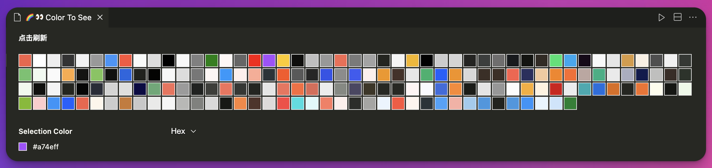
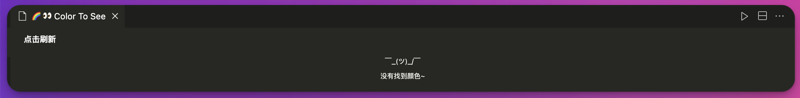

# 🌈 👀 Color To See

<br />

`Color to See` 是一个 Visual Studio Code 插件，用于搜索和展示您当前工作区内的所有颜色值。它允许用户快速查看、复制、定位和使用这些颜色，提高设计和开发的效率。





## 功能

- 搜索颜色值：自动扫描当前的工作区中所有文件的颜色值。
- 展示颜色网格：在一个特定的编辑器中清晰地列出所有颜色，颜色网格展示。
- 快速获取颜色值：支持一键复制颜色值到剪贴板，方便在代码或设计中使用。
- 快速定位颜色值：支持定位颜色值，色块双击后可以快速跳转到定义该颜色值的文件和具体位置。
- 支持多种颜色格式：包括 HEX、RGB 和 HSL 等常见格式。

## 快速使用

- 使用快捷键 `Ctrl+Shift+P` 或 `Cmd+Shift+P` 打开面板，输入关键词`ColorToSee`，选择下列命令。
  >`ColorToSee: Show colors of the working directory in a webview panel`
- 文件改变（新增、删除、修改）后，点击刷新重新加载颜色网格。
- 打开`setting.json`文件修改默认配置`color-to-see.findFilesRules`，设置过滤文件

Color to See 插件能让你轻松查找并操作工作区内的颜色值。以下是一些基本的步骤来开始使用这个插件：

### 如何打开颜色网格视图

1. 使用快捷键 `Ctrl+Shift+P (Windows/Linux)` 或 `Cmd+Shift+P (macOS)` 打开命令面板。
2. 输入关键词 ColorToSee，然后从下拉菜单中选择：

- `ColorToSee: Show colors of the working directory in a webview panel`

  这将打开一个 Webview 面板，展示当前工作区内所有文件的颜色值。

### 刷新颜色网格

- 如果工作区文件有所变更（新增、删除或修改），可以点击面板中的“刷新”按钮重新加载颜色网格，确保颜色信息是最新的。

### 自定义插件设置

可以打开 VSCode 的 `settings.json` 文件来修改默认配置。通过调整 `color-to-see.findFilesRules` 配置项的`include`和`exclude`属性，设置文件过滤规则，以控制哪些文件应被扫描（或排除）以寻找颜色值。这些配置使用 [Glob Pattern](https://code.visualstudio.com/docs/editor/glob-patterns) 语法来指定哪些文件被包括或排除。

示例配置
下面是一个如何设置 `include` 和 `exclude` 的示例，该示例将只包括 CSS 和 JavaScript 文件，同时排除一些常见的不需要搜索的目录和文件类型：

```json
{
    "color-to-see.findFilesRules": {
        "default": {
            "include": [
                "**/*.css",
                "**/*.js"
            ],
            "exclude": [
                "**/node_modules/**",
                "**/dist/**",
                "**/build/**",
                "**/*.min.*",
                "**/*.map",
                ".git",
                "**/*.png",
                "**/*.jpg",
                "**/*.jpeg",
                "**/*.gif",
                "**/*.bmp",
                "**/*.svg"
            ]
        }
    }
}
```

## 运行条件

[VS Code 1.87.0+](https://code.visualstudio.com/)
[Node.js 18+](https://nodejs.org/en)

## 插件配置项

请跳转至[快速使用-自定义插件设置](#自定义插件设置)查看

## 支持

如果在使用 Color to See 时遇到任何问题或有改进建议，请通过 GitHub Issues 提交。

## 更新日志

(待补充)

Users appreciate release notes as you update your extension.
<!-- "color-highlight.hslWithNoFunctionLanguages": ["*"] -->
### 1.0.0

Initial release of ...

### 1.0.1

Fixed issue #.

### 1.1.0

Added features X, Y, and Z.

---

## 贡献

感谢您对 Color to See 的兴趣！如果您希望贡献代码或提出功能请求，请通过 GitHub 项目页面联系我们。

**Enjoy!**
